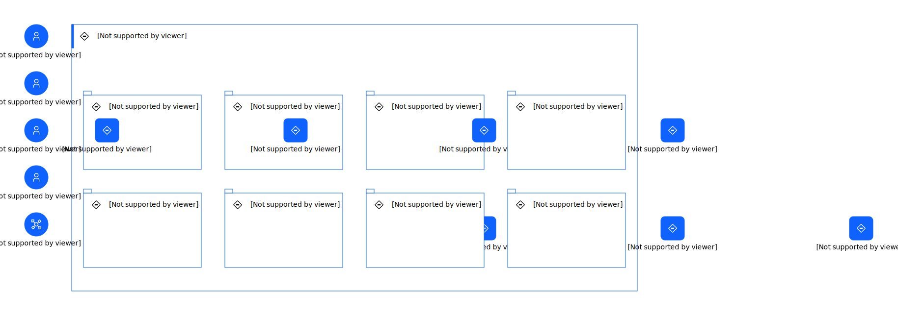

---
tags:
    - AOD-ITS
---

#  IT System View

### Description

Generated by genAI

## Element(s)

### Actor(s)

| Name | Description | Type | GenericGroup |
| --- | --- | --- | --- |
| 2 | 
2
 | IT System |  |
| Client | 
The client is a leading consulting firm that offers strategic advisory services to businesses across various industries, specializing in growth strategies, market analysis, and operational efficiency.
 | Human |  |
| Consultant | 
A consultant is an expert who works closely with clients to develop customized solutions that drive business success, providing high-level strategic guidance and implementation support.
 | Human |  |
| System Administrator | 
The system administrator is responsible for managing and maintaining the target system, ensuring its stability, security, and performance, and providing technical support to users.
 | Human |  |
| User | 
The user is an individual who interacts with the target system to access its features and functionality, potentially including clients, consultants, and other stakeholders.
 | Human |  |

### Subsystem(s)

| Name | Description | Sub-Diagram |
| --- | --- | --- |
| Client Management Subsystem | 
Manages client information and communication records
 |  |
| Consulting Service Management Subsystem | 
Manages consulting services and client engagements
 |  |
| Customized Solution Development Subsystem | 
Supports the development of customized solutions for clients
 |  |
| Market Analysis Subsystem | 
Provides market analysis tools and features
 |  |
| Operational Efficiency Subsystem | 
Provides operational efficiency tools and features
 |  |
| Reporting and Analytics Subsystem | 
Provides reporting and analytics capabilities
 |  |
| Security and Access Control Subsystem | 
Ensures the security and integrity of client data
 |  |
| User Management Subsystem | 
Manages user accounts and access control
 |  |

### Location(s)

| Name | Description |
| --- | --- | 
 | Data Center | 
A secure data center hosting the target system
 |

### Logical Node(s)

    

Client Management Node

<table>
    <caption></caption>
    <tr>
        <td> <strong>Name</strong> </td>
        <td>Client Management Node</td>
    </tr>
    <tr>
        <td> <strong>Description</strong> </td>
        <td>
Manages client information and communication records
</td>
    </tr>
    <tr>
        <td> <strong>Related Diagrams</strong> </td>
        <td>
                
<a href="../../../../Architecture/Architecture-Overview/IT-System-View/IT-System-View">IT System View</a>
</td>
    </tr>
</table>

    

Consulting Service Management Node

<table>
    <caption></caption>
    <tr>
        <td> <strong>Name</strong> </td>
        <td>Consulting Service Management Node</td>
    </tr>
    <tr>
        <td> <strong>Description</strong> </td>
        <td>
Manages consulting services and client engagements
</td>
    </tr>
    <tr>
        <td> <strong>Related Diagrams</strong> </td>
        <td>
                
<a href="../../../../Architecture/Architecture-Overview/IT-System-View/IT-System-View">IT System View</a>
</td>
    </tr>
</table>

    

Customized Solution Development Node

<table>
    <caption></caption>
    <tr>
        <td> <strong>Name</strong> </td>
        <td>Customized Solution Development Node</td>
    </tr>
    <tr>
        <td> <strong>Description</strong> </td>
        <td>
Supports the development of customized solutions for clients
</td>
    </tr>
    <tr>
        <td> <strong>Related Diagrams</strong> </td>
        <td>
                
<a href="../../../../Architecture/Architecture-Overview/IT-System-View/IT-System-View">IT System View</a>
</td>
    </tr>
</table>

    

Market Analysis Node

<table>
    <caption></caption>
    <tr>
        <td> <strong>Name</strong> </td>
        <td>Market Analysis Node</td>
    </tr>
    <tr>
        <td> <strong>Description</strong> </td>
        <td>
Provides market analysis tools and features
</td>
    </tr>
    <tr>
        <td> <strong>Related Diagrams</strong> </td>
        <td>
                
<a href="../../../../Architecture/Architecture-Overview/IT-System-View/IT-System-View">IT System View</a>
</td>
    </tr>
</table>

    

Operational Efficiency Node

<table>
    <caption></caption>
    <tr>
        <td> <strong>Name</strong> </td>
        <td>Operational Efficiency Node</td>
    </tr>
    <tr>
        <td> <strong>Description</strong> </td>
        <td>
Provides operational efficiency tools and features
</td>
    </tr>
    <tr>
        <td> <strong>Related Diagrams</strong> </td>
        <td>
                
<a href="../../../../Architecture/Architecture-Overview/IT-System-View/IT-System-View">IT System View</a>
</td>
    </tr>
</table>

    

Reporting and Analytics Node

<table>
    <caption></caption>
    <tr>
        <td> <strong>Name</strong> </td>
        <td>Reporting and Analytics Node</td>
    </tr>
    <tr>
        <td> <strong>Description</strong> </td>
        <td>
Provides reporting and analytics capabilities
</td>
    </tr>
    <tr>
        <td> <strong>Related Diagrams</strong> </td>
        <td>
                
<a href="../../../../Architecture/Architecture-Overview/IT-System-View/IT-System-View">IT System View</a>
</td>
    </tr>
</table>

    

Security and Access Control Node

<table>
    <caption></caption>
    <tr>
        <td> <strong>Name</strong> </td>
        <td>Security and Access Control Node</td>
    </tr>
    <tr>
        <td> <strong>Description</strong> </td>
        <td>
Ensures the security and integrity of client data
</td>
    </tr>
    <tr>
        <td> <strong>Related Diagrams</strong> </td>
        <td>
                
<a href="../../../../Architecture/Architecture-Overview/IT-System-View/IT-System-View">IT System View</a>
</td>
    </tr>
</table>

    

User Management Node

<table>
    <caption></caption>
    <tr>
        <td> <strong>Name</strong> </td>
        <td>User Management Node</td>
    </tr>
    <tr>
        <td> <strong>Description</strong> </td>
        <td>
Manages user accounts and access control
</td>
    </tr>
    <tr>
        <td> <strong>Related Diagrams</strong> </td>
        <td>
                
<a href="../../../../Architecture/Architecture-Overview/IT-System-View/IT-System-View">IT System View</a>
</td>
    </tr>
</table>

    

