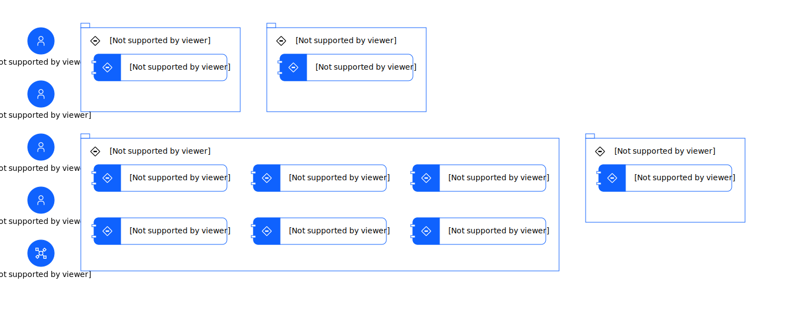

---
tags:
    - AOD-Svc
---

#  Service View

### Description

Generated by genAI

## Element(s)

### Actor(s)

| Name | Description | Type | GenericGroup |
| --- | --- | --- | --- |
| 2 | 
2
 | IT System |  |
| Client | 
The client is a leading consulting firm that offers strategic advisory services to businesses across various industries, specializing in growth strategies, market analysis, and operational efficiency.
 | Human |  |
| Consultant | 
A consultant is an expert who works closely with clients to develop customized solutions that drive business success, providing high-level strategic guidance and implementation support.
 | Human |  |
| System Administrator | 
The system administrator is responsible for managing and maintaining the target system, ensuring its stability, security, and performance, and providing technical support to users.
 | Human |  |
| User | 
The user is an individual who interacts with the target system to access its features and functionality, potentially including clients, consultants, and other stakeholders.
 | Human |  |

### Subsystem(s)

| Name | Description | Sub-Diagram |
| --- | --- | --- |
| Application Layer | 
Handles business logic and provides services for the target system
 |  |
| Data Layer | 
Handles data storage and management
 |  |
| Integration Layer | 
Handles integration with other systems and tools
 |  |
| Presentation Layer | 
Handles user interactions and provides an interface for human actors
 |  |

### Logical Component(s)

    

Consulting Service Management Service

<table>
    <caption></caption>
    <tr>
        <td> <strong>Name</strong> </td>
        <td>Consulting Service Management Service</td>
    </tr> 
    <tr>
        <td> <strong>Description</strong> </td>
        <td>
Manages consulting services and client engagements
</td>
    </tr>
</table>

    

Customized Solution Development Service

<table>
    <caption></caption>
    <tr>
        <td> <strong>Name</strong> </td>
        <td>Customized Solution Development Service</td>
    </tr> 
    <tr>
        <td> <strong>Description</strong> </td>
        <td>
Supports the development of customized solutions for clients
</td>
    </tr>
    <tr>
        <td> <strong>Functional Requirement</strong> </td>
        <td>
FR-6 - Customized Solution Development
</td>
    </tr>
</table>

    

Data Storage Service

<table>
    <caption></caption>
    <tr>
        <td> <strong>Name</strong> </td>
        <td>Data Storage Service</td>
    </tr> 
    <tr>
        <td> <strong>Description</strong> </td>
        <td>
Stores and manages data for the target system
</td>
    </tr>
    <tr>
        <td> <strong>Functional Requirement</strong> </td>
        <td>
FR-4 - Market Analysis

FR-6 - Customized Solution Development

FR-7 - Reporting and Analytics

FR-5 - Operational Efficiency
</td>
    </tr>
</table>

    

Integration Service

<table>
    <caption></caption>
    <tr>
        <td> <strong>Name</strong> </td>
        <td>Integration Service</td>
    </tr> 
    <tr>
        <td> <strong>Description</strong> </td>
        <td>
Integrates with other systems and tools, such as CRM, ERP, and marketing automation systems
</td>
    </tr>
    <tr>
        <td> <strong>Functional Requirement</strong> </td>
        <td>
FR-9 - Integration with Other Systems
</td>
    </tr>
</table>

    

Market Analysis Service

<table>
    <caption></caption>
    <tr>
        <td> <strong>Name</strong> </td>
        <td>Market Analysis Service</td>
    </tr> 
    <tr>
        <td> <strong>Description</strong> </td>
        <td>
Provides market analysis tools and features
</td>
    </tr>
    <tr>
        <td> <strong>Functional Requirement</strong> </td>
        <td>
FR-4 - Market Analysis
</td>
    </tr>
</table>

    

Operational Efficiency Service

<table>
    <caption></caption>
    <tr>
        <td> <strong>Name</strong> </td>
        <td>Operational Efficiency Service</td>
    </tr> 
    <tr>
        <td> <strong>Description</strong> </td>
        <td>
Provides operational efficiency tools and features
</td>
    </tr>
    <tr>
        <td> <strong>Functional Requirement</strong> </td>
        <td>
FR-5 - Operational Efficiency
</td>
    </tr>
</table>

    

Reporting and Analytics Service

<table>
    <caption></caption>
    <tr>
        <td> <strong>Name</strong> </td>
        <td>Reporting and Analytics Service</td>
    </tr> 
    <tr>
        <td> <strong>Description</strong> </td>
        <td>
Provides reporting and analytics capabilities
</td>
    </tr>
    <tr>
        <td> <strong>Functional Requirement</strong> </td>
        <td>
FR-7 - Reporting and Analytics
</td>
    </tr>
</table>

    

User Interface

<table>
    <caption></caption>
    <tr>
        <td> <strong>Name</strong> </td>
        <td>User Interface</td>
    </tr> 
    <tr>
        <td> <strong>Description</strong> </td>
        <td>
Provides an intuitive and user-friendly interface for users
</td>
    </tr>
    <tr>
        <td> <strong>Functional Requirement</strong> </td>
        <td>
FR-6 - Customized Solution Development

FR-4 - Market Analysis

FR-7 - Reporting and Analytics

FR-5 - Operational Efficiency
</td>
    </tr>
</table>

    

User Management Service

<table>
    <caption></caption>
    <tr>
        <td> <strong>Name</strong> </td>
        <td>User Management Service</td>
    </tr> 
    <tr>
        <td> <strong>Description</strong> </td>
        <td>
Manages user accounts and access control
</td>
    </tr>
    <tr>
        <td> <strong>Functional Requirement</strong> </td>
        <td>
FR-8 - Security and Access Control
</td>
    </tr>
</table>

    

