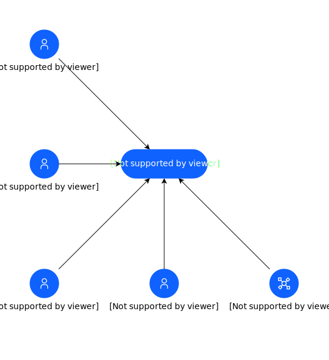

### Name

systemcontext

### Description

Generated by genAI

## Element(s)

### Target System(s)

| Name | Description |
| --- | --- |
 | 2 | 
2
 |

### Actor(s)

| Name | Description | Type | GenericGroup |
| --- | --- | --- | --- |
 | 2 | 
2
 | IT System |  |
 | Client | 
The client is a leading consulting firm that offers strategic advisory services to businesses across various industries, specializing in growth strategies, market analysis, and operational efficiency.
 | Human |  |
 | Consultant | 
A consultant is an expert who works closely with clients to develop customized solutions that drive business success, providing high-level strategic guidance and implementation support.
 | Human |  |
 | System Administrator | 
The system administrator is responsible for managing and maintaining the target system, ensuring its stability, security, and performance, and providing technical support to users.
 | Human |  |
 | User | 
The user is an individual who interacts with the target system to access its features and functionality, potentially including clients, consultants, and other stakeholders.
 | Human |  |

